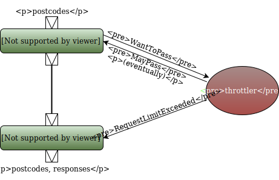
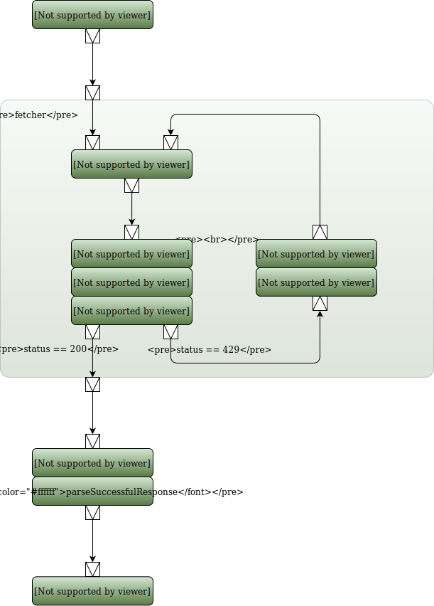

This is the second half of a two-part series on Akka streams. In the [first post](/blog/scraping-apis-with-akka-streams), we used Akka streams to query the Yelp API for thousands of postcodes. In this post, we build on this program to build a robust scraper that will work for several days, unsupervised, within the constraints provided by the Yelp API.

## Sprint 5 &ndash; exploring failure responses

We now have a program that will serialize responses from the Yelp API. Our program can recover from crashes, since it only tries to query postcodes it has not serialized yet. 

We have, so far, ignored error responses from Yelp. This can lead to pathological behaviour if we let the program run for a long time: the Yelp API (like most APIs) has a request limit. Exceeding this request limit repeatedly can, presumably, get you banned. There may also be other error responses that we must be aware of. We need to better understand how the Yelp API responds when it does not like our query.

We therefore want to change our program to carry on querying the API until it receives ten responses with a status code other than 200. We hope that these ten responses will be representative of all the errors we are likely to get. We can use the [`limitWeighted`](http://doc.akka.io/docs/akka/2.4.17/scala/stream/stages-overview.html#limitWeighted) flow component to implement this circuit-breaker behaviour. `limitWeighted` works by computing a weight for each element flowing through it and stopping the stream when the sum of the weights of the elements seen so far exceeds a threshold. Thus, by passing in a function that assigns a weight of 1 to failure responses and 0 otherwise, we can halt our stream after a certain number of failures.

```scala
import play.api.libs.ws.WSResponse

val maxErrors = 10 // Stop the stream after seeing this many error codes
val errorLimiter: Flow[(String, WSResponse), (String, WSResponse), NotUsed] =
  Flow[(String, WSResponse)].limitWeighted(maxErrors.toLong) {
    case (postcode, response) => if (response.status == 200) 0 else 1
  }
```

We also need to log each error as it arises. We therefore define an `errorLogger` flow component that we can hook into our stream:

```scala
val errorLogger: Flow[(String, WSResponse), (String, WSResponse), NotUsed] =
  Flow[(String, WSResponse)].map { case (postcode, response) =>
    if (response.status != 200) {
      log.warn(
        s"Non 200 response for postcode $postcode: " + 
        s"[status: ${response.status}, body: ${response.body}]")
    }

    (postcode -> response)
  }
```

We can use our limiter and logger as part of the source:

```scala
val postcodeResponses: Source[PostcodeRestaurants, NotUsed] = 
  Source(remainingPostcodes.take(30000))
    .mapAsync(8) { postcode =>
      YelpApi.fetchPostcode(postcode).map { response => (postcode -> response) }
    }
    .via(StreamMonitor.monitor(1000) { count => log.info(s"Processed $count restaurants") })
    .via(errorLogger)
    .via(errorLimiter)
    .filter { case (postcode, response) => response.status == 200 }
    .map { case(postcode, response) =>
      val restaurants = YelpApi.parseSuccessfulResponse(postcode, response)
      PostcodeRestaurants(postcode, restaurants)
    }
```

We can now let the stream run over a much larger set of postcodes. We take the first 30,000 postcodes from our source and process those. We also need to increase the timeout waiting for the IO result to a few hours:

```scala
val ioResult = Await.result(ioResultFuture, 2.hours)
```

The full code for sprint 5 is:

```scala
// Sprint5.scala

import scala.concurrent.{Future, Await}
import scala.concurrent.duration._

import java.nio.file.{Paths, StandardOpenOption}
import java.time.LocalDateTime

import akka.actor.ActorSystem
import akka.stream._
import akka.stream.scaladsl._
import akka.NotUsed
import akka.util.ByteString

import play.api.libs.json.{JsObject, Json}
import play.api.libs.ws.WSResponse
import play.api.libs.ws.ahc.AhcWSClient
import play.api.Logger

object Sprint5 extends App {

  // Instantiate an actor system and materializer
  implicit val system = ActorSystem("Sprint5")
  val log = Logger("Sprint5")
  import system.dispatcher // provides an execution context
  implicit val materializer = ActorMaterializer()

  // We need a web service client for querying the API
  implicit val ws = AhcWSClient()

  val outputPath = Paths.get("postcode_restaurants.json")
  val parallelismLevel = 8 // Number of concurrent threads to use to query the Yelp API
  val maxErrors = 10 // Stop the stream after seeing this many error codes

  def serializePostcodeRestaurant(postcodeRestaurants: PostcodeRestaurants): JsObject =
    Json.obj(
      "postcode" -> postcodeRestaurants.postcode,
      "fetch_time" -> LocalDateTime.now.toString,
      "data" -> postcodeRestaurants.restaurants
    )

  val postcodeResponseSerializer: Sink[PostcodeRestaurants, Future[IOResult]] = {
    val outputOpenOptions = Set(
      StandardOpenOption.CREATE,
      StandardOpenOption.WRITE,
      StandardOpenOption.APPEND
    )
    Flow[PostcodeRestaurants]
      .map { serializePostcodeRestaurant }
      .map { json => ByteString(Json.stringify(json) + '\n') }
      .toMat(FileIO.toPath(outputPath, outputOpenOptions))(Keep.right)
  }

  val errorLimiter: Flow[(String, WSResponse), (String, WSResponse), NotUsed] =
    Flow[(String, WSResponse)].limitWeighted(maxErrors.toLong) {
      case (postcode, response) => if (response.status == 200) 0 else 1
    }

  val errorLogger: Flow[(String, WSResponse), (String, WSResponse), NotUsed] =
    Flow[(String, WSResponse)].map { case (postcode, response) =>
      if (response.status != 200) {
        log.warn(s"Non 200 response for postcode $postcode: [status: ${response.status}, body: ${response.body}]")
      }
      (postcode -> response)
    }

  // Load the list of postcodes to query
  val allPostcodes: List[String] = PostcodeLoader.load()
  log.info(s"Found ${allPostcodes.size} unique postcodes.")

  // Load the list of postcodes we have already processed
  val donePostcodes: Set[String] = ExistingPostcodes.load(outputPath)
  log.info(s"Found ${donePostcodes.size} already processed.")

  // Filter the list of postcodes
  val remainingPostcodes = allPostcodes.filterNot { donePostcodes }
  log.info(s"There are ${remainingPostcodes.size} still to do.")

  // Define a source of restaurant arrays
  val postcodeResponses: Source[PostcodeRestaurants, NotUsed] =
    Source(remainingPostcodes.take(30000))
      .mapAsync(8) { postcode =>
        YelpApi.fetchPostcode(postcode).map { response => (postcode -> response) }
      }
      .via(StreamMonitor.monitor(1000) { count => log.info(s"Processed $count restaurants") })
      .via(errorLogger)
      .via(errorLimiter)
      .filter { case (postcode, response) => response.status == 200 }
      .map { case(postcode, response) =>
        val restaurants = YelpApi.parseSuccessfulResponse(postcode, response)
        PostcodeRestaurants(postcode, restaurants)
      }

  val ioResultFuture = postcodeResponses.runWith(postcodeResponseSerializer)

  val ioResult = Await.result(ioResultFuture, 2.hours)
  println(s"Written ${ioResult.count} bytes to $outputPath")

  // clean up
  ws.close()
  materializer.shutdown()
  Await.ready(system.terminate(), 5.seconds)
}
```

Running this reveals three 400 error and, after about 20,000 requests, we just get seven 429 status codes in a row, at which point our stream shuts down. The body of the responses contains the error code `ACCESS_LIMIT_REACHED`. We have to then wait several hours before the API returns anything other than 429 errors:

```
> runMain Sprint5
[info] Running Sprint5
[info] 2017-02-26 11:43:53,080 INFO [Sprint5] - Found 249304 unique postcodes.
[info] 2017-02-26 11:43:53,121 INFO [Sprint5] - Found 0 already processed.
[info] 2017-02-26 11:43:53,144 INFO [Sprint5] - There are 249304 still to do.
[info] 2017-02-26 11:44:37,182 WARN [Sprint5] - Non 200 response for postcode ab15bt: [status: 400, body: {"error": {"code": "LOCATION_NOT_FOUND", "description": "Could not execute search, try specifying a more exact location."}}]
[info] 2017-02-26 11:45:06,854 INFO [Sprint5] - Processed 1000 restaurants
[info] 2017-02-26 11:46:10,908 INFO [Sprint5] - Processed 2000 restaurants
[info] 2017-02-26 11:47:37,733 INFO [Sprint5] - Processed 3000 restaurants
[info] 2017-02-26 11:49:05,803 INFO [Sprint5] - Processed 4000 restaurants
[info] 2017-02-26 11:50:23,321 INFO [Sprint5] - Processed 5000 restaurants
[info] 2017-02-26 11:51:36,831 INFO [Sprint5] - Processed 6000 restaurants
[info] 2017-02-26 11:53:02,174 INFO [Sprint5] - Processed 7000 restaurants
[info] 2017-02-26 11:54:11,278 INFO [Sprint5] - Processed 8000 restaurants
[info] 2017-02-26 11:55:22,739 INFO [Sprint5] - Processed 9000 restaurants
[info] 2017-02-26 11:56:34,058 INFO [Sprint5] - Processed 10000 restaurants
[info] 2017-02-26 11:57:33,325 INFO [Sprint5] - Processed 11000 restaurants
[info] 2017-02-26 11:58:41,710 INFO [Sprint5] - Processed 12000 restaurants
[info] 2017-02-26 11:59:53,187 INFO [Sprint5] - Processed 13000 restaurants
[info] 2017-02-26 12:01:05,196 INFO [Sprint5] - Processed 14000 restaurants
[info] 2017-02-26 12:01:35,063 WARN [Sprint5] - Non 200 response for postcode bd213te: [status: 400, body: {"error": {"description": "Could not execute search, try specifying a more exact location.", "code": "LOCATION_NOT_FOUND"}}]j
[info] 2017-02-26 12:13:07,599 INFO [Sprint5] - Processed 15000 restaurants
[info] 2017-02-26 12:14:22,411 INFO [Sprint5] - Processed 16000 restaurants
[info] 2017-02-26 12:15:38,091 INFO [Sprint5] - Processed 17000 restaurants
[info] 2017-02-26 12:16:59,731 INFO [Sprint5] - Processed 18000 restaurants
[info] 2017-02-26 12:18:21,427 INFO [Sprint5] - Processed 19000 restaurants
[info] 2017-02-26 12:18:59,206 WARN [Sprint5] - Non 200 response for postcode bn12sjp: [status: 400, body: {"error": {"code": "LOCATION_NOT_FOUND", "description": "Could not execute search, try specifying a more exact location."}}]
[info] 2017-02-26 12:19:55,108 INFO [Sprint5] - Processed 20000 restaurants
[info] 2017-02-26 12:21:12,655 WARN [Sprint5] - Non 200 response for postcode bn252hu: [status: 429, body: {"error": {"description": "You've reached the access limit for this client.  Please email api@yelp.com for assistance", "code": "ACCESS_LIMIT_REACHED"}}]
[info] 2017-02-26 12:21:12,655 WARN [Sprint5] - Non 200 response for postcode bn252jb: [status: 429, body: {"error": {"description": "You've reached the access limit for this client.  Please email api@yelp.com for assistance", "code": "ACCESS_LIMIT_REACHED"}}]
[info] 2017-02-26 12:21:12,655 WARN [Sprint5] - Non 200 response for postcode bn252jd: [status: 429, body: {"error": {"description": "You've reached the access limit for this client.  Please email api@yelp.com for assistance", "code": "ACCESS_LIMIT_REACHED"}}]
[info] 2017-02-26 12:21:12,656 WARN [Sprint5] - Non 200 response for postcode bn252jf: [status: 429, body: {"error": {"description": "You've reached the access limit for this client.  Please email api@yelp.com for assistance", "code": "ACCESS_LIMIT_REACHED"}}]
[info] 2017-02-26 12:21:12,673 WARN [Sprint5] - Non 200 response for postcode bn252lt: [status: 429, body: {"error": {"code": "ACCESS_LIMIT_REACHED", "description": "You've reached the access limit for this client.  Please email api@yelp.com for assistance"}}]
[info] 2017-02-26 12:21:12,674 WARN [Sprint5] - Non 200 response for postcode bn252pf: [status: 429, body: {"error": {"code": "ACCESS_LIMIT_REACHED", "description": "You've reached the access limit for this client.  Please email api@yelp.com for assistance"}}]
[info] 2017-02-26 12:21:12,853 WARN [Sprint5] - Non 200 response for postcode bn252pu: [status: 429, body: {"error": {"code": "ACCESS_LIMIT_REACHED", "description": "You've reached the access limit for this client.  Please email api@yelp.com for assistance"}}]
[info] [ERROR] [02/26/2017 12:21:12.860] [Sprint5-akka.stream.default-blocking-io-dispatcher-16] [akka://Sprint5/user/StreamSupervisor-0/flow-0-1-fileSink] Tearing down FileSink(postcode_restaurants.json) due to upstream error
[info] akka.stream.StreamLimitReachedException: limit of 10 reached
```

## Sprint 6 &ndash; throttling to avoid rate limits

To query the API for every postcode in our dataset, we could just run the program we have built so far several times, letting it crash every time it exceeds the rate limit. We would want to wait between restarts for our request quota to regenerate. However, we can do better: we can throttle the stream when we start receiving 429 responses.

The strategy for throttling the stream is inspired by [this example](http://doc.akka.io/docs/akka/2.4.17/scala/stream/stream-cookbook.html#Globally_limiting_the_rate_of_a_set_of_streams) in the Akka streams cookbook. We define a throttler actor to keep track of whether we are currently rate limited. Before every API request, we check with the actor whether we may proceed. If the throttler lets us proceed, we query the API and check the status code of the response. If the status code is 429,  we inform the throttler, which then blocks further requests for half an hour.



Our throttler actor has two states: either open or closed. It will queue any request it receives while closed and release the queued requests when it opens. We encode those two states with two different `Receive` method and use `context.become` to switch between the two:

```scala
import akka.actor.{ActorSystem, ActorRef, Actor, Props}
import akka.pattern.ask

object Throttler {
  // messages received
  case object WantToPass
  case object RequestLimitExceeded

  // messages sent by this actor
  case object MayPass

  // messages sent to itself
  case object Open

  def props(log: Logger): Props = Props(classOf[Throttler], log)
}

class Throttler(log: Logger) extends Actor {

  import Throttler._
  import context.dispatcher

  private var waitQueue = immutable.Queue.empty[ActorRef]
  
  val holdTime = 30.minutes  // how long the throttler remains closed

  override def receive: Receive = open
  
  val open: Receive = {
    case WantToPass =>
      sender() ! MayPass
    case RequestLimitExceeded =>
      log.info(s"Request limit exceeded: throttling for ${holdTime}")
      context.become(closed)
      sheduleOpen() // schedule opening again after `holdTime`
  }

  val closed: Receive = {
    case WantToPass =>
      log.info("Currently throttled: queueing request.")
      waitQueue = waitQueue.enqueue(sender())
    case Open =>
      log.info("Releasing waiting actors")
      context.become(open)
      releaseWaiting()
      log.debug("Actors released")
  }

  private def releaseWaiting(): Unit = {
    waitQueue.foreach { _ ! MayPass }
    waitQueue = immutable.Queue.empty
  }

  private def sheduleOpen(): Unit = {
    context.system.scheduler.scheduleOnce(holdTime) { self ! Open }
  }
}
```

We can now change the API query flow to go through the throttler before every request. Let's factor out querying the API into a flow element:

```scala
import akka.actor.ActorRef
import akka.util.Timeout
import akka.pattern.ask

def apiQuerier(parallelismLevel: Int, throttler: ActorRef)
: Flow[String, (String, WSResponse), NotUsed] =
  Flow[String].mapAsync(parallelismLevel) { postcode =>
    import system.dispatcher // provides an execution context
    implicit val throttledTimeout = Timeout(2.hours)  // needs to be longer than the hold time
    for {
      _ <- throttler ? Throttler.WantToPass
      response <- YelpApi.fetchPostcode(postcode)
    } yield (postcode -> response)
  }
```

Our new `apiQuerier` works as follows: prior to making a request, we send a message to the throttler. If the throttler is open, it will reply straightaway, letting us hit the Yelp API. If the throttler is closed, it will not reply immediately. Instead, it will queue our query until it is scheduled to open again. When the throttler opens, it replies to all queued queries, letting us hit the API.

We also need to notify the throttler when the API tells us that we have exceeded the request limit.

```scala
def throttlerNotifier(throttler: ActorRef)
    : Flow[(String, WSResponse), (String, WSResponse), NotUsed] = {
  Flow[(String, WSResponse)].map { case (postcode, response) =>
    if (response.status == 429) {
      throttler ! Throttler.RequestLimitExceeded
    }
    postcode -> response
  }
}
```

Finally, let's change the `errorLimiter` flow element to avoid counting responses with status 429 as errors, since we are handling these as part of the stream.

```scala
val errorLimiter: Flow[(String, WSResponse), (String, WSResponse), NotUsed] =
  Flow[(String, WSResponse)].limitWeighted(maxErrors.toLong) {
    case (postcode, response) =>
      if (response.status == 200 || response.status == 429) 0 else 1
  }
```

We can now instantiate a throttler as part of our main program and alter the stream to use the two new flow elements that we have defined:

```scala
val throttler = system.actorOf(Throttler.props(log))

// Define a source of restaurant arrays
val postcodeResponses: Source[PostcodeRestaurants, NotUsed] =
  Source(remainingPostcodes.take(30000))
    .via(apiQuerier(parallelismLevel, throttler))
    .via(throttlerNotifier(throttler))
    .via(StreamMonitor.monitor(1000) { count => log.info(s"Processed $count restaurants") })
    .via(errorLogger)
    .via(errorLimiter)
    .filter { case (postcode, response) => response.status == 200 }
    .map { case(postcode, response) =>
      val restaurants = YelpApi.parseSuccessfulResponse(postcode, response)
      PostcodeRestaurants(postcode, restaurants)
    }
```

If Akka streams did not have backpressure, the queue in our throttler actor would fill up: it would carry on receiving postcodes to fetch from upstream and, since it is throttled, would store them in its queue. When it re-opens, it would release all those requests, which would swamp the API. We would therefore have to control the rate at which we release the queue when we re-open.

Thanks to backpressure, when the throttler is closed, the flow stage querying the API fills up (up to `$parallelismLevel`). Once it is full, it stops requesting postcodes from upstream, which eventually backpressures all the way to the source. Thus, our throttler actor only contains up to `$parallelismLevel` references in its queue.

## Sprint 7 &ndash; requeuing failed postcodes

Our code is now definitely shippable but let's, for completeness, make one last improvement (I don't get to gold-plate my code at work, so I need to compensate in personal projects). At the moment, any time we query a postcode and receive a 429 response, we just drop that postcode. We don't try to fetch it again. This means that, by the end of the run, we are missing a few hundred postcodes that may have returned valid responses. We could just run the program again to get those postcodes, but let's instead try to re-queue them. 

We will introduce another branch in our stream: rather than just taking postcodes from our initial set, we will also take postcodes from a separate queue of postcodes that we received 429 responses for. Thus, our stream now looks like this:




We can hide the complexity of hitting the API, dealing with rate limits and re-queuing in a single flow element (the `fetcher` compound element in the diagram above). Since this flow element contains two branches, we cannot define it with the simple DSL we have used so far. We use the [graph DSL](http://doc.akka.io/docs/akka/2.4.17/scala/stream/stream-graphs.html) instead.

```scala

// flow element that partitions according to the response status
val responsePartitioner = Partition[(String, WSResponse)](2, s => s._2.status match {
  case 200 => 0
  case 429 => 1
  case status =>
    // other response statuses should have been filtered out already
    log.error(s"Unexpected status code $status")
    throw new IllegalStateException(s"Unexpected status code $status")
})

def errorFilter(log: Logger) = Flow[(String, WSResponse)].filter {
  case (postcode, response) =>
    response.status match {
      case 200 | 429 => true
      case _ =>
        log.warn(
          s"Unexpected response for postcode $postcode: "+
            s"[status: ${response.status}, body: ${response.body}]")
        false
    }
}

def fetcher(
  parallelismLevel: Int, 
  log: Logger, 
  throttler: ActorRef
): Flow[String, (String, WSResponse), NotUsed] =
  Flow.fromGraph(
    GraphDSL.create() { implicit builder =>
      import GraphDSL.Implicits._
      val postcodeSource = builder.add(Merge[String](2))
      val partitioner = builder.add(responsePartitioner)

      // normal flow: fetch postcodes and pass them to partitioner
      postcodeSource ~>
        apiQuerier(parallelismLevel, throttler) ~>
        errorFilter(log) ~>
        partitioner

      // re-queuing flow: push postcodes with 429 error codes through a flow that
      // alerts the throttler and then back into the source
      partitioner.out(1) ~>
        throttlerNotifier(throttler) ~>
        Flow[(String, WSResponse)]
          .map { case (postcode, response) => postcode }
          .buffer(1000, OverflowStrategy.fail) ~>
        postcodeSource.in(1)
      FlowShape(postcodeSource.in(0), partitioner.out(0))
    }
)
```

Our `fetcher` flow element offers a simple interface: you feed it postcodes and it returns tuples mapping postcodes to successful responses. This hides a tremendous amount of complexity: parallelism, API throttling and requeuing. The `fetcher` contains two streams: 

- the *normal* stream that takes postcodes, uses them to query the API and feeds them into the partitioner, which will feed them on if the return code is 200.

- the *backwards* stream that takes responses with status code 429, alerts the throttler and pushes the associated postcode back upstream of the API.

The need to re-queue postcodes introduces a cycle in our stream. When a stream contains a cycle, we need to be aware of liveness issues. We need to include a buffer in the backwards stream. If we do not do this, the partitioner will backpressure as soon as the `apiQuerier` steps throttles, since there is nowhere for failed postcodes to go. The stream would be deadlocked. Placing a buffer in the backwards stream avoids this since it guarantees that the partitioner can always push postcodes through.

Buffers introduce complexity into a stream, since they can hide liveness issues for a while. They can also be a source of instability: what happens when the buffer fills up? Fortunately, in this case, we know approximately how many elements our buffer is likely to hold. Our buffer will hold all the postcodes that the stream has attempted to query, but failed because of rate limitations. This will grow by `$parallelismLevel` every time we release the throttle but still get 429 from the API. We think the API request limit resets every twelve hours, and we try to push new postcodes through every half hour, so our buffer will contain a maximum of `$parallelismLevel * 12 / 2` postcodes in a 12 hour API throttling period. The factor of `1/2` arises because our source will take half the postcodes from its right input (retrying existing postcodes) and half from its left input. Thus, every time the throttler opens prematurely, it injects `$parallelismLevel / 2` new postcodes into our buffer. It also takes out `$parallelismLevel / 2` postcodes, but puts them back when it finds out that it is still throttled.

We can now run the entire pipeline, removing the error limiter. The full stream is now:

```scala
// Define a source of restaurant arrays
val postcodeResponses: Source[PostcodeRestaurants, NotUsed] =
  Source(remainingPostcodes)
    .via(fetcher(parallelismLevel, log, throttler))
    .via(StreamMonitor.monitor(1000) { count => log.info(s"Processed $count restaurants") })
    .map { case(postcode, response) =>
      val restaurants = YelpApi.parseSuccessfulResponse(postcode, response)
      PostcodeRestaurants(postcode, restaurants)
    }

val ioResultFuture = postcodeResponses.runWith(postcodeResponseSerializer)

val ioResult = Await.result(ioResultFuture, 31.days)
println(s"Written ${ioResult.count} bytes to $outputPath")
```

Running the entire pipeline for all 250,000 takes about five days, most of which is spent waiting while throttled.

## Conclusion

Building robust programs to fetch large quantities of data from web APIs can be difficult. My previous attempts have involved long, complex Python scripts that grow warts over time to tackle some of the issues mentioned in this post. Akka streams provides a powerful, declarative interface that allow us to manage this complexity in a sane way.

## Colophon

The code and the prose for this post were developed on [SherlockML](https://sherlockml.com), a development environment for data science that we have developed at [ASI Data Science](https://www.asidatascience.com). Typically, running the code for this post requires spinning up a server on AWS, installing the dependencies and lots of painful copying of artefacts. Using SherlockML saved me an hour of drudgery.

The diagrams in this post were made using [draw.io](https://www.draw.io/).

[&#8606; Previous post](/blog/scraping-apis-with-akka-streams)