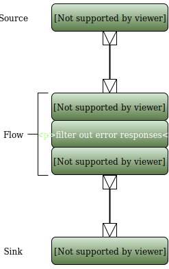

Getting data out of APIs sounds easy. After all, that's the point of APIs. And
yet, this is often one of the more challenging aspects of
building an ETL pipeline. In this post, I demonstrate how to
use [Akka streams](http://doc.akka.io/docs/akka/2.4.17/scala/stream/index.html) to extract large quantities of data from the [Yelp](https://www.yelp.co.uk/developers/documentation/v3) API.

This post does not aim to explain Akka streams: there is
great
[documentation](http://doc.akka.io/docs/akka/2.4.17/scala/stream/stream-quickstart.html) for
that. Instead, I want to demonstrate how the library helped me solve a
real-world problem.


The reason extracting data from APIs can be challenging stems from an impedance
mismatch between the API's *raison d'être* and our motivation as data
scientists. APIs are often built to support a web application, which typically
requires fast access to very small quantities of data. Yelp, for instance, shows
you reviews for a single restaurant at a time. Thus, they are
typically optimized for serving many small payloads with very low latency. This
often means that they are not suited for serving large payloads, which is
exactly what we, as data scientists, are after.

This means that extracting large amounts of data from the API
often requires writing very long-running scripts (typically days or weeks) that make
hundreds of thousands or millions of API queries. This brings a whole host of
new challenges:

 - the script needs to be resilient: it will spend most of its time running
   without someone checking what it's doing, so it might be many hours before
   someone notices that something is going wrong. It is therefore important that
   the program avoids pathological behaviour (e.g. spamming the API once the
   request limit is exceeded) and that, if it crashes, we only lose a small
   amount of work: we must be able to restart it easily.
 
 - the script needs to be efficient. When the runtime of a script is measured in
   days or weeks, spending more programmer time to double or quadruple the speed
   at which the script runs is often time well-spent. The bulk of the time will
   be spent waiting on REST calls. The easiest way to improve runtime is
   therefore to process those in parallel. However, this brings a host of
   concurrency issues that must now be addressed.
 
 - lack of knowledge about the problem domain: unlike when developing
   application software, we will only run this script a small number of times.
   We therefore have very incomplete information about the problem domain. What
   error codes does the API return? How does it behave when rate-limiting the
   user? How error prone is it? How reproducible are the errors? We rarely know
   this when we start developing and it is difficult to find this out without
   running the script.

To summarize, we want to build pipelines that are highly parallel and
resilient. Akka streams are a great fit for this type of data processing.

The code for this blog post was developed as part of an ongoing study of how
hygiene correlates with restaurant reviews. As input, we have
a [list](http://data.scala4datascience.com/restaurants/restaurants.json) of
postcodes that may contain restaurants. We want to query the Yelp API for all
restaurants in each of these postcodes. We will just save the responses in a
flat file containing one response per line. 

*Acknowledgements*: [Alessandra Staglianò](https://uk.linkedin.com/in/alessandra-staglian%25C3%25B2-1b72b88) came up with the idea of correlating restaurant reviews with hygiene ratings and helped with understanding the behaviour of the Yelp API. As always, the data engineering team at [ASI Data Science](https://www.asidatascience.com/) is also a tremendous source of ideas.

## Running the sample code

The code snippets in this post are available on [GitHub](https://github.com/pbugnion/api-scraping-akka-streams).

To run the code, you will need a token for the Yelp API. Read the paragraph on *Authentication* in the [API documentation](https://www.yelp.co.uk/developers/documentation/v3/get_started).

The code is organized into seven distinct sprints. Each sprint gives us more insight into the behaviour of the API and adds a component to the pipeline.

## Sprint 1 &ndash; exploring the API

For our first sprint, we can just check what responses we get from the API. We query the API for the first 100 postcodes and print the response body. We will just filter out responses that are not 200, for now. 

To query the API, we need a REST client. We will use [Play's `AhcWSClient`](https://www.playframework.com/documentation/2.5.x/ScalaWS) since it's asynchronous and non-blocking and generally plays well with Akka. We also need a library for parsing JSON. We will use [`play-json`](https://www.playframework.com/documentation/2.5.x/ScalaJson).

Let's start by defining a case class encapsulating a postcode and a list of restaurants in that postcode. We will represent each restaurant as an opaque JSON object.

```scala
// PostcdeRestaurants.scala

class PostcodeRestaurants(postcode: String, restaurants: List[JsObject])
```

Our stream will take, as input, a list of postcodes and (for now) print the Yelp API response to screen. Let's start by defining a source for our stream. We won't worry about missing imports just yet:

```scala
val postcodes: List[String] = PostcodeLoader.load()  // Load the list of postcodes to query

// Define a source of restaurant arrays
val postcodeResponses: Source[PostcodeRestaurants, NotUsed] = Source(postcodes.take(100))
```

The `PostcodeLoader.load` methods just loads the list of postcodes we are interested in (from a static file served on S3). We just take the first 100 postcodes for our source. We can now push each of these postcodes through a flow element that queries the Yelp API and converts the response to a `PostcodeRestaurants` instance.

```scala
val parallelismLevel = 8

val postcodeResponses: Source[PostcodeRestaurants, NotUsed] = Source(postcodes.take(100))
  .mapAsync(parallelismLevel) { postcode =>
    YelpApi.fetchPostcode(postcode).map { response => (postcode -> response) }
  }
  .filter { case (postcode, response) => response.status == 200 }
  .map { case(postcode, response) =>
    val restaurants = YelpApi.parseSuccessfulResponse(postcode, response)
    PostcodeRestaurants(postcode, restaurants)
  }
```

We use the [`mapAsync`](http://doc.akka.io/docs/akka/2.4.17/scala/stream/stages-overview.html#mapAsync) flow element to query the API in parallel. The `mapAsync` flow component applies a function returning a future to the input stream asynchronously. The first argument of `mapAsync` is the number of elements to process in parallel. Thus, by setting that number to 8, we will dispatch 8 queries to the API at a time: Akka streams gives us parallelism for free. After the `mapAsync` flow, we just filter out responses that are not 200, for now, and extract a JSON array of restaurants.

All that's left to do now is to print each `PostcodeRestaurant` instance to screen and materialize the stream:

```scala
postcodeResponses.runForeach {
  case PostcodeRestaurants(postcode, restaurants) => println(restaurants)
}
```



For this example to work, we need to make a materializer implicitly available. Many of the methods defined in the `YelpApi` object also require that a Play `WSClient` be implicitly available. The full code listing for our first sprint is:

```scala
// Sprint1.scala

import scala.concurrent.Await
import scala.concurrent.duration._

import akka.actor.ActorSystem
import akka.stream._
import akka.stream.scaladsl._
import akka.NotUsed

import play.api.libs.ws.ahc.AhcWSClient

object Sprint1 extends App {

  // Instantiate an actor system and materializer
  implicit val system = ActorSystem("Sprint1")
  import system.dispatcher // provides an execution context
  implicit val materializer = ActorMaterializer()

  // We need a web service client for querying the API
  implicit val ws = AhcWSClient()

  val parallelismLevel = 8 // Number of concurrent threads to use to query the Yelp API

  val postcodes: List[String] = PostcodeLoader.load()  // Load the list of postcodes to query

  // Define a source of restaurant arrays
  val postcodeResponses: Source[PostcodeRestaurants, NotUsed] =
    Source(postcodes.take(100))
      // Query the API for a postcode
      .mapAsync(parallelismLevel) { postcode =>
        YelpApi.fetchPostcode(postcode).map { response => (postcode -> response) }
      }
      .filter { case (postcode, response) => response.status == 200 }
      // extract the restaurants in that postcode
      .map { case(postcode, response) =>
        val restaurants = YelpApi.parseSuccessfulResponse(postcode, response)
        PostcodeRestaurants(postcode, restaurants)
      }

  postcodeResponses.runForeach {
    case PostcodeRestaurants(postcode, restaurants) => println(restaurants)
  }

  Thread.sleep(10000) // give the stream time to run

  // clean up
  ws.close()
  materializer.shutdown()
  Await.ready(system.terminate(), 5.seconds)
}
```

## Sprint 2 &ndash; serializing results

Printing results to screen is great, but we really want to save the results to disk. Our source, `postcodeResponses`, is just a stream of `PostcodeRestaurant` instances. We want to hook this up to a sink that converts each `PostcodeRestaurant` instance into a single JSON object and saves it to disk. We can use the [`toPath`](http://doc.akka.io/docs/akka/2.4.17/scala/stream/stages-overview.html#toPath) sink, which just takes `ByteString` elements and saves them to a file.

```scala
import scala.concurrent.Future

import java.nio.file.{Paths, StandardOpenOption}

import akka.util.ByteString

val outputPath = Paths.get("postcode_restaurants.json")

// A new sink for our stream
val postcodeResponseSerializer: Sink[PostcodeRestaurants, Future[IOResult]] = {
  val outputOpenOptions = Set(
    StandardOpenOption.CREATE,
    StandardOpenOption.WRITE
  )
  Flow[PostcodeRestaurants]
    .map { serializePostcodeResponse } // convert `PostcodeRestaurant` to `JsObject`
    .map { json => ByteString(Json.stringify(json) + '\n') }
    .toMat(FileIO.toPath(outputPath, outputOpenOptions))(Keep.right)
}
```

The `serializePostcodeResponse` method just converts `PostcodeRestaurant` instances to JSON:

```scala
import java.time.LocalDateTime

import play.api.libs.json.{JsObject, Json}

// Convert a `PostcodeRestaurant` into JSON
def serializePostcodeRestaurant(postcodeRestaurants: PostcodeRestaurants): JsObject = 
  Json.obj(
    "postcode" -> postcodeRestaurants.postcode,
    "fetch_time" -> LocalDateTime.now.toString,
    "data" -> postcodeRestaurants.restaurants
  )
```

Our sink builds JSON, turns it into a string and saves it to the file `outputPath`. It materializes to an Akka [`Future[IOResult]`](http://doc.akka.io/api/akka/2.4/akka/stream/IOResult.html). The future completes when the stream completes. We just hook this new sink up to our stream:

```scala
val ioResultFuture = postcodeResponses.runWith(postcodeResponseSerializer)
```

We can replace the call to `Thread.sleep` with an await on `ioResultFuture`:

```scala
val ioResult = Await.result(ioResultFuture, 600.seconds)
println(s"Written ${ioResult.count} bytes to $outputPath")
```

## Backpressure

Probably the biggest benefit Akka streams provide over other stream processors is *backpressure*: let's imagine that writing to disk proves slow, such that our API fetcher produces new instances of `PostcodeRestaurant` faster than we can serialize them. Without backpressure, the additional instances would be stored in a buffer that grows until we run out of memory. Our system becomes unstable. Akka streams avoid this by implementing a *pull* system: downstream components pull work from upstream components when they have capacity. The entire stream pulls elements from the source as fast as the slowest component can process them. This means that work never builds up in intermediate buffers. While this scenario is unlikely if we are writing to disk, it could conceivably happen if we were serializing results to a database. 


## Sprint 3 &ndash; restarting the program

With the current implementation, we overwrite the existing responses every time the program is restarted. Since it takes a few days to fetch all the postcodes in our list, we would prefer to avoid losing all the postcodes we have fetched every time the program crashes. We therefore want to restart the program from where it left off, rather than from the beginning. We can do this by not re-fetching postcodes we have already processed. At start-up, we read the output file to get a list of all the postcodes we have already fetched. Let's write a method to load the postcodes we have already processed:

```scala
// ExistingPostcodes.scala

import scala.io
import scala.util.Try

import java.nio.file.Path
import java.io.FileNotFoundException

import play.api.libs.json.Json

object ExistingPostcodes {
  def load(path: Path): Set[String] = {
    Try { io.Source.fromFile(path.toFile) }
      .map {
        _.getLines
          .map { Json.parse }
          .map { json => (json \ "postcode").as[String] }
          .toSet
      }
      .recover {
        // output file does not exist yet: we have not fetched any postcodes yet.
        case t: FileNotFoundException => Set.empty[String]
      }
      .get
  }

}
```

We must now strip out these postcodes from the list of postcodes that the program must process. 

```scala
import play.api.Logger
val log = Logger("Sprint3")

// Load the list of postcodes to query
val allPostcodes: List[String] = PostcodeLoader.load()
log.info(s"Found ${allPostcodes.size} unique postcodes.")

// Load the list of postcodes we have already processed
val donePostcodes: Set[String] = ExistingPostcodes.load(outputPath)
log.info(s"Found ${donePostcodes.size} postcodes already processed.")

// Filter the list of postcodes
val remainingPostcodes = allPostcodes.filterNot { donePostcodes }
log.info(s"There are ${remainingPostcodes.size} still to do.")

// Use `remainingPostcodes` in our stream
val postcodeResponses: Source[PostcodeRestaurants, NotUsed] = 
  Source(remainingPostcodes.take(1000))
    .mapAsync { ... } // remainder of the stream is unchanged.
```

We could also have integrated filtering for postcodes into our stream, but doing up front lets us know exactly how many postcodes we still have to process, which is useful for logging and for estimating how long the program will take to run.

The only remaining change is to avoid overwriting existing postcodes when serializing the stream. We want to always append to the output file. We can do this by passing an extra flag when opening the output file. The sink is now:

```scala
val postcodeResponseSerializer: Sink[PostcodeRestaurants, Future[IOResult]] = {
  val outputOpenOptions = Set(
    StandardOpenOption.CREATE,
    StandardOpenOption.WRITE,
    StandardOpenOption.APPEND
  )
  Flow[PostcodeRestaurants]
    .map { serializePostcodeRestaurant }
    .map { json => ByteString(Json.stringify(json) + '\n') }
    .toMat(FileIO.toPath(outputPath, outputOpenOptions))(Keep.right)
}
```

## Sprint 4 &ndash; measuring flow

We now serialize successful responses, and program crashes do not result in significant loss of work. We are almost ready to run our code on a larger sample of the postcodes. One thing missing is the ability to measure the progress of our program. Currently, the only way of doing this is to count the number of lines in the output file. In this sprint, we integrate flow measurement into our pipeline. We will print a message for every 1000 postcodes that we process.

We want to build a pipeline stage that counts the number of postcodes that flow through it and logs a message every 1000 elements. Since several components of our pipeline are asynchronous, we cannot just increment a variable outside the pipeline, since that might be subject to race conditions. One possible solution would be to use a [Java atomic integer](https://docs.oracle.com/javase/8/docs/api/java/util/concurrent/atomic/AtomicInteger.html). We will use an actor instead. The actor just counts the number of messages it receives and logs a message for every 1000 messages. Since the actor processes messages linearly, we avoid race conditions.

```scala
// StreamMonitor.scala

import akka.actor.{Actor, Props}

object StreamMonitor {
  // Messages received.
  case object ElementReceived

  def props(logEvery: Int)(logMessage: Int => Unit): Props = Props(
    classOf[StreamMonitor], logEvery, logMessage: Int => Unit)
}

class StreamMonitor(logEvery: Int, logMessage: Int => Unit)
extends Actor {
  import StreamMonitor._
  var numberElements = 0

  def receive: Receive = {
    case ElementReceived =>
      numberElements += 1
      if (numberElements % logEvery == 0) { logMessage(numberElements) }
  }
}
```

We can now define a flow stage that pushes its elements through unchanged, but notifies the `StreamMonitor` for every element. We will embed the flow definition in the `StreamMonitor` companion object:

```scala
import akka.actor.{Actor, Props, ActorSystem}
import akka.stream.scaladsl.Flow
import akka.NotUsed

def monitor[T](logEvery: Int)(logMessage: Int => Unit)(implicit system: ActorSystem): Flow[T, T, NotUsed] = {
  val monitorActor = system.actorOf(props(logEvery)(logMessage))
  Flow[T].map { element => 
    monitorActor ! ElementReceived
    element
  }
}
```

We can now add this `monitor` stage to our pipeline:

```scala
// postcode source
val postcodeResponses: Source[PostcodeRestaurants] =
  Source(remainingPostcodes.take(3000))
    .mapAsync(8) { postcode =>
      YelpApi.fetchPostcode(postcode).map { response => (postcode -> response) }
    }
    .via(StreamMonitor.monitor(1000) { count => log.info(s"Processed $count restaurants") })
    .filter { case (postcode, response) => response.status == 200 }
    .map { case(postcode, response) =>
      val restaurants = YelpApi.parseSuccessfulResponse(postcode, response)
      PostcodeRestaurants(postcode, restaurants)
    }
```

Our pipeline will now print log messages for every 1000 elements it has processed:

```none
> runMain Sprint4
[info] Running Sprint4
[info] 2017-02-26 11:30:54,933 INFO [Sprint4] - Found 249304 unique postcodes.
[info] 2017-02-26 11:30:59,154 INFO [Sprint4] - Found 70646 already processed.
[info] 2017-02-26 11:30:59,251 INFO [Sprint4] - There are 178658 still to do.
[info] 2017-02-26 11:32:49,519 INFO [Sprint4] - Processed 1000 restaurants
[info] 2017-02-26 11:34:41,984 INFO [Sprint4] - Processed 2000 restaurants
[info] 2017-02-26 11:36:40,863 INFO [Sprint4] - Processed 3000 restaurants
[info] Written 2542957 bytes to postcode_restaurants.json
[success] Total time: 367 s, completed Feb 26, 2017 11:36:44 AM
>
```

Since we create a new actor for every `monitor` flow element, we could re-use this stage in several places in our stream. This might be useful if we were to split the stream into several branches. We could then measure the flow through each branch.

## Conclusion

In this post, we built a robust scraper that could ask the Yelp API for data on thousands of postcodes. The scraper is not yet ready to run unsupervised, though. We will explore this in [second half](/blog/scraping-apis-with-akka-streams-2) of this blog post.

## Colophon

The code and the prose for this post were developed on [SherlockML](https://sherlockml.com), a development environment for data science that we have developed at [ASI Data Science](https://www.asidatascience.com). Typically, running the code for this post requires spinning up a server on AWS, installing the dependencies and lots of painful copying of artefacts. Using SherlockML saved me an hour of drudgery.

[Next post &#8608;](/blog/scraping-apis-with-akka-streams-2)