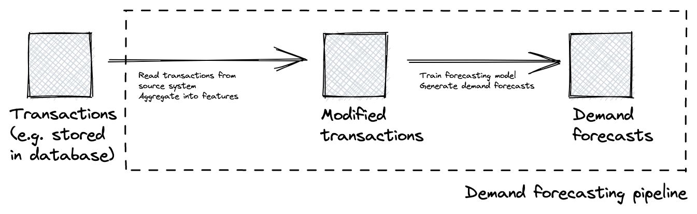

Data versioning is a [critical component of safe intelligent software systems](https://faculty.ai/tech-blog/machine-learning-systems-should-use-data-aware-orchestrators/). But how should we version data? We can't just assign a version number to a particular dataset, like we would for a code repository, because [data is not self-documenting](/notes/data-versioning-not-git-for-data): seeing the diff between two different versions of a CSV won't help me audit how that CSV was generated, or really understand the difference between these two versions<Sidenote>Before the [hordes of CSV haters](https://donatstudios.com/CSV-An-Encoding-Nightmare) swoop down on me, replace CSV with some compressed binary format like Parquet or Avro in the previous sentence: the resulting diff is even less interpretable.</Sidenote>.

## What should our data versioning system enable?

When versioning data, [we care about](/notes/data-versioning-not-git-for-data):
- reproducibility and auditability: understanding how the data was generated
- enabling downstream consumers by giving them visibility over how the data changes and allowing them to develop and test against fixed versions of the data<Sidenote>Developing data pipelines is hard enough without having to wonder whether the reason my pipeline is broken is due to an upstream change in the data, or because of some change I made in my code.</Sidenote>
- running longitudinal studies to understand how the data changes over time

How can we implement a data versioning system that supports this? Let's imagine we want to understand how a specific version of a dataset was generated. We want to be able to:
- retrieve a specific, pinned version of a dataset, for auditability, and to enable downstream consumers who can develop and test based on a specific version.
- retrieve the logs of the run that generated this data version, to audit what happened. This helps both auditability and allows downstream consumers to understand how their inputs are changing.
- retrieve the particular version of the code for that process and the environment that code ran in (e.g. a specific Docker image), so we can understand the process and reproduce it.
- retrieve the parameters for that run, for auditability, reproducibility, and for running longitudinal studies
- retrieve the input datasets and their specific versions, for auditability and so we can reproduce a specific run exactly.

## How should we implement it?

Notice how most of what we need from a data versioning system is information about the process that generates the data, rather than about the data itself.

A simple data versioning scheme that satisfies all these criteria is to create a new version of the data for each run of the process that generates it, and to use the run identifier as the version number for the data. This gives us all the criteria we care about, provided the system we use to track runs stores parameters, logs and references to a commit of the repository that contains the process code. This scheme means all datasets generated by the same process are versioned together.

For instance, let's imagine a simple pipeline that generates demand forecasts. This pipeline might read from a database of transactions, create a derived dataset where transactions are aggregated by day or month, and, from this, train a forecasting model and emit forecasts. This pipeline would run at a regular cadence, e.g. daily or weekly.

In this pipeline, versions of the datasets _Modified transactions_ and _Demand forecasts_ are both generated by a run of the demand forecasting pipeline. They are then versioned according to the run ID of the demand forecasting pipeline. For each run of the pipeline (whether triggered at a regular cadence, or as the result of changes in code), we get a new version of the data.

<FullWidthImage src="/data-versioning-linked-to-process-runs-2.png" />

## Concrete implementations

How could we implement a lightweight data versioning system using open source tools?
- [MLflow](https://mlflow.org/) experiment tracking: Use MLflow's artifact store to store the datasets generated for each run. If each MLflow run corresponds to a run of the process, the data generated is versioned, linked back to the run. If MLflow is used to store parameters for the run and the version of e.g. a Docker container used for the run, the process is auditable. MLflow doesn't store the run logs, but, we can keep a reference to the pipeline runner that executed the process (for instance, an AWS Batch execution).
- Use a [data aware orchestrator](https://faculty.ai/tech-blog/machine-learning-systems-should-use-data-aware-orchestrators/) like [Dagster](https://dagster.io/), making sure the data generated for each run is stored, namespaced by the run ID, e.g. through the IO management process. This is what we use in [Frontier](https://faculty.ai/frontier/). In this case, the parameters and the logs are naturally stored with the run.

---

By tracking data as part of our run-tracking system, we can create a fully auditable, reproducible data versioning system.
