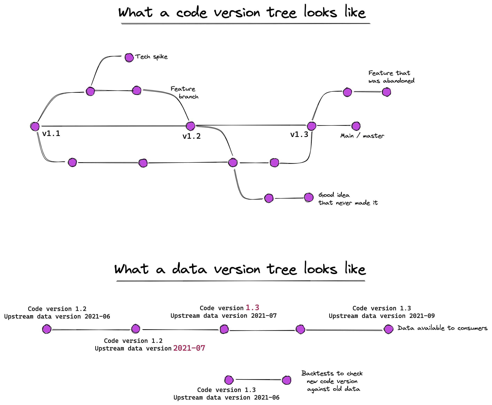
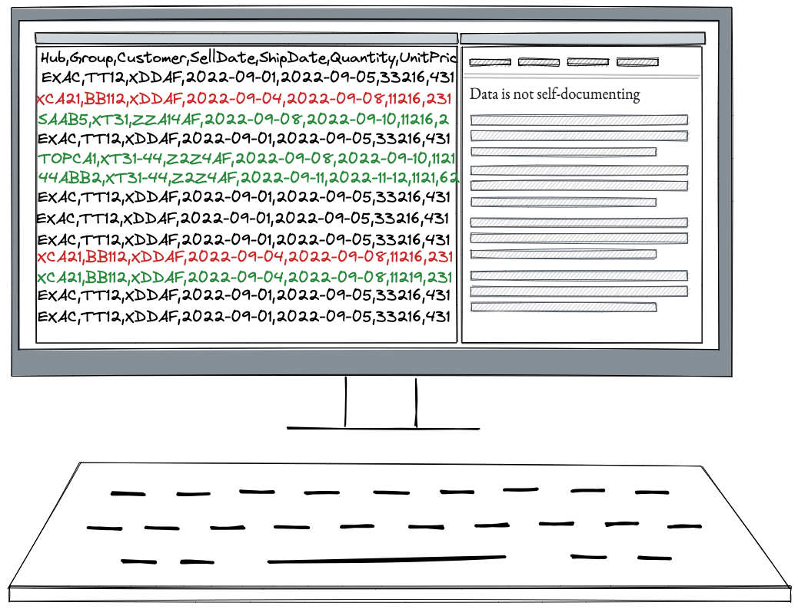

Code versioning and data versioning have very different purposes. Too much of the thinking around data versioning tries to blindly use metaphors and abstractions that have worked well for versioning code, without thinking about whether those metaphors make sense for data versioning<Sidenote>For instance [here](https://lakefs.io/?utm_source=Gads&utm_medium=G&utm_campaign=Gadsdatavcntrl&gclid=Cj0KCQjw4uaUBhC8ARIsANUuDjXfDXkfmhcLOzzfMhRSfvy3B65Dyu-A0-2XTOHsaCQRJsTB9TZqv_IaAnruEALw_wcB) and [here](https://research.aimultiple.com/data-versioning/).</Sidenote>.

## Why do we version code?

We version code to enable _experimentation_ and _collaboration_.

When a user creates a commit, they have a set of changes they're comfortable with. By committing, they define a fixed point to come back to when experimenting. Versioning therefore enables experimentation without endangering the existing code base.

Version control also enables collaboration. Features like branching, merging, and pull requests allow teams to collaborate on a single code base without treading on each other's toes.

The main value of source control is not auditability. Sure, `git blame` and `git bisect` can tell us when a regression was introduced. But even if those weren't available, people would still use version control for code.

## And what about data?

Version control for data is different. Data scientists don't collaborate on a dataset. They might use it as input, or tweak the process that generates it, but they aren't *manually* editing the data in the same way they might edit code. Data is a byproduct of some process.

So why version data? There are three common reasons:
- auditability and reproducibility: Increasingly, automated, intelligent systems make decisions based on data, or support decisions by presenting insights or recommendations based on data. For instance, an automatic system might forecast the demand for a company's products. This forecast might be used to automatically generate downstream purchase orders for raw materials, or to help inform budgets. Decisions made based on data need to be auditable and reproducible, so that people can go back and understand the state of the system when the decision was made. Data versioning is part of this audit trail.
- to enable downstream consumers to develop pipelines that use this data. Having a fixed version of the dataset, rather than one that changes over time, makes it much easier to develop and test the code you're writing.
- the data versions themselves may hold interesting content: they paint a picture of how that dataset changed over time, which may inform how the context in which the organisation operates changes over time. Being able to run longitudinal studies across versions helps understand the time evolution of that data. Take, for instance, our automated forecasting system: running longitudinal studies against past forecasts allows us to back-test the quality of the forecasts.

## Data is not self-documenting

Code changes are self-documenting. By reading the diff between two code versions, I can understand what changed. This is enhanced through the addition of metadata linked to the change, like commit messages or pull request descriptions.

Data changes are, by contrast, not self-documenting. I can't easily tell whether the difference between two versions of a dataset arise from differences in the data they were generated from, or the code that was used for the transformation etc. To make sense of the difference between two versions of the same data, I need access to information beyond the dataset: what version of the code was used to create this version? What happened during the generation process? What parameters or options were passed to the process generating the data? What versions of the upstream datasets were used as input?

Thus, data changes are not, by themselves, self-documenting. It's only when they can be [linked back to the generating process](/notes/data-versioning-linked-to-runs) that we can make sense of them.

## So what?

The modern entreprise will get increasingly automated. [Data versioning will be critical to automation happening safely](https://faculty.ai/tech-blog/machine-learning-systems-should-use-data-aware-orchestrators/). But blindly cargo-culting metaphors from code versioning will get in the way.

In [the next post](/notes/data-versioning-linked-to-runs), we will explore practical implementations of a data versioning system fit for AI powered organisations.
