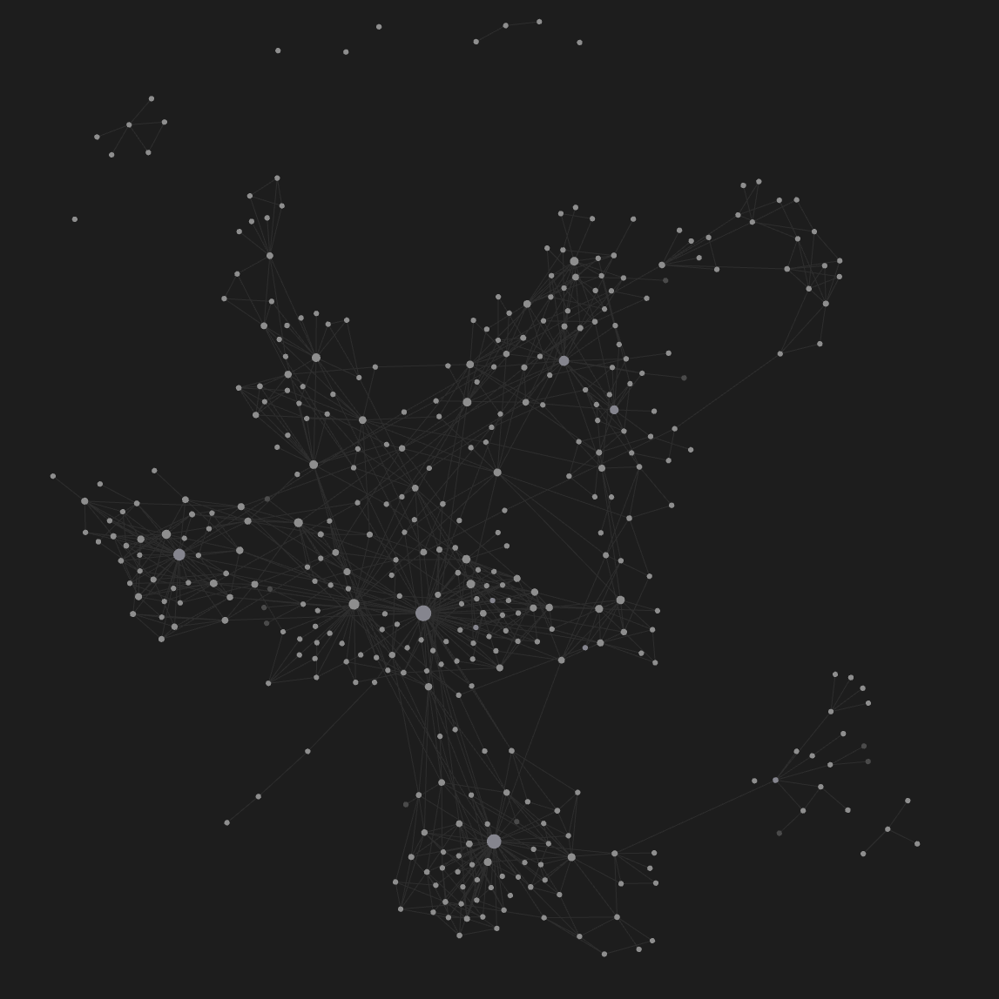
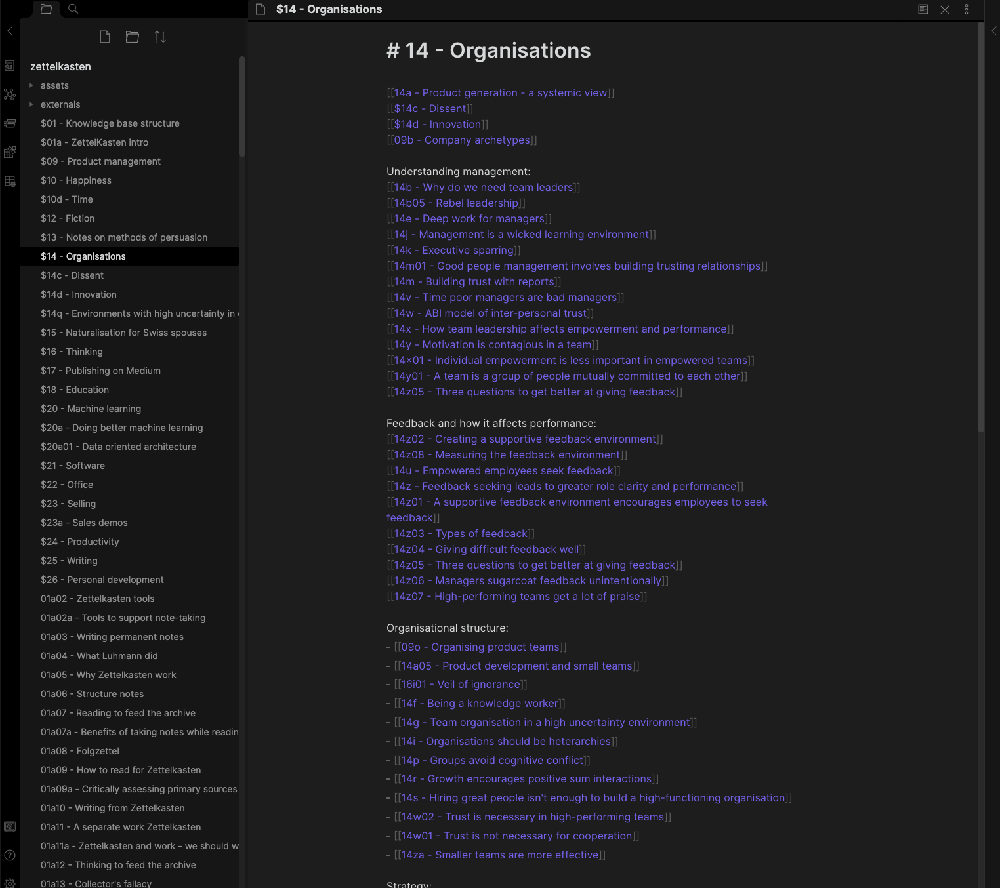

Zettelkastens[^5] seem to be in vogue, at least in the corners of the Internet that I frequent. I started mine in July 2020, soon after I stumbled upon the concept. Surprisingly, the practice stuck, and I have been growing the archive at the rate of a handful of notes per week to reach the dizzying height of 374 notes.

I iterated on my workflow, archive structure, and tools a few times in the early days. They have remained static long enough that I feel comfortable writing about them.

I use Zettelkasten primarily for notes that are not dependent on a specific work context. While I do both use and build my Zettelkasten at work, I don't feed the archive with knowledge that only makes sense in the context of [Faculty](https://faculty.ai). I experimented with Zettelkasten for work, but it never stuck.

## My workflow for feeding the archive

My workflow consists of three sequential stages. 

In the *collection* stage, I read or listen to a podcast, and jot interesting sentences or thoughts in a paper notebook[^1]. My focus is on understanding the author's point of view. Handwriting notes lets me be more focussed than digital note-taking.

Once I finish a chapter, a paper, or a podcast, I start the *processing* stage. I look at the handwritten notes and try to assemble them into concrete ideas. I structure my notes following the Zettelkasten principles of atomicity (each note should contain a single idea) and autonomy (each note should have enough context to stand alone).

I typically draft on paper and then and copy the note out to [Obsidian](https://obsidian.md/). I prefer to draft on paper. I considered using a physical archive, but the easy storage and retrieval afforded by a digital medium far outweigh the cost of transcribing from a paper note to Obsidian.

While drafting, I typically have several related notes open[^2] as I try to mesh what I'm drafting with the notes currently in the archive. This reconciliation produces the most divergent thinking (and that is, after all, [the point of note-taking](https://notes.andymatuschak.org/%E2%80%9CBetter_note-taking%E2%80%9D_misses_the_point%3B_what_matters_is_%E2%80%9Cbetter_thinking%E2%80%9D)). Being forced to see how new ideas fit with what's in my archive makes me think much more critically about what I read, and what it means for me[^3].

When I finish drafting a set of notes, I start the *integration* stage, where I embed the new notes in the archive. I think of a relevant title for each note, add links in relevant hub notes (a form of index, explained below), and look for other notes that could be enriched by being linked to the new notes. This integration stage is essential to Zettelkasten: it turns notes from a collection of [orphaned thoughts](https://www.mentalnodes.com/do-not-keep-orphan-notes) into a coherent, structured knowledge base.

## How the archive is structured

My archive broadly follows what I understand as Luhmann's structure. It is built entirely in Obsidian.

Each note is a markdown file called something like `14x01 - Individual empowerment is less important in empowered teams`. The ID --`14x01`  -- situates the note within the archive. The second part -- the title -- identifies what's in the note[^4]. While the IDs have some structure, that structure is less important than the structure that emerges through links to an from this note.

To provide entry points and discoverability, I have [hub notes](https://zettelkasten.de/posts/three-layers-structure-zettelkasten/) related to a particular concept. Content notes can be referenced in multiple hubs. The hubs are typically just lists of notes, loosely grouped into topics.

The archive has three navigation mechanisms:
- Hub notes add a curated path through the notes, grouping together several (sometimes dozens) of notes on a particular topic. They provide good entrypoints into the archive.
- Links between content notes (both forward and backlinks) allow exploring a particular topic and encourage finding unusual connections.
- Title and full text search allow retrieving all the information I have ever written about a particular topic.

---

Zettelkasten encourage knowledge acquisition by making it visible through a growing archive and an increasingly dense graph. The small dopamine hit I get every time I add a note encourages me to read more, and think more critically about what I read.

[^1]: This is similar to the concept of literature notes in most Zettelkasten implementations, except that I typically throw away the jots once they have been turned into permanent notes.
[^2]: Obsidian's split pane view is great for this.
[^3]: How memory works remains a matter of debate. In his book "how to take smart notes", Ahrens suggests that a possible model is that we store every experience we have, but our brain inhibits access to most of our memory to focus on information that is relevant at the current time. If we truly are constrained by our ability to *retrieve* memory (rather than by our ability to store it), having a "good memory" means being able to retrieve the right bit of information at the right time. This comes from having a dense network of connections between ideas in the brain. By encouraging us to think about connections between ideas explicitly, Zettelkasten ought to facilitate retrieval. 
[^4]: See Andy Matuschak's [evergreen note titles are like APIs](https://notes.andymatuschak.org/Evergreen_note_titles_are_like_APIs) for how to structure note titles.
[^5]: If you have not come across Zettelkastens before, these two articles provide a good introduction: [how one german scholar was so productive](https://writingcooperative.com/zettelkasten-how-one-german-scholar-was-so-freakishly-productive-997e4e0ca125) and [the Zettelkasten method](https://www.lesswrong.com/posts/NfdHG6oHBJ8Qxc26s/the-zettelkasten-method-1). The canonical book is Sönke Ahrens' [How to take smart notes](https://www.amazon.co.uk/How-Take-Smart-Notes-Nonfiction-ebook/dp/B06WVYW33Y).
