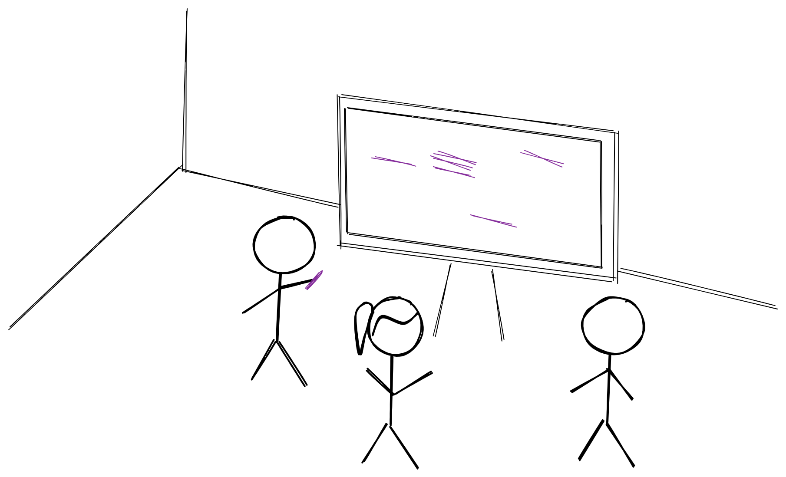

People work for many different reasons. For pay, for status, or because they believe in the cause, because society expects it. I have slightly atypical motivations.

I get tremendous enjoyment out of my work at [Faculty](https://faculty.ai). Most of my enjoyment comes from fulfilling two needs:
- I need to build things. I get very strong positive feelings of craftsmanship from seeing things grow and develop. This isn't limited to software (I used to love woodwork at school), but there's no other craft that lets you tinker and experiment with quite the same velocity as developing digital products. I suspect this love for the craft is shared by many engineers and designers. Funnily enough, I still get the same pleasure now that I'm less immediately involved in the building process, and in more of a technical lead role. It's less visceral and immediate, but equally fulfilling in the long term.
- I need to share the process of building things with great people. I get much more enjoyment out of building something with someone else than working by myself. One of my great joys at work is collaborating on designing a feature or solving a problem with other people and getting to a solution we're happy with, and then seeing that built. In this sense, I see work as predominantly social: the pleasure I get is from having positive social interactions. The work itself both guarantees alignment (I know the people I collaborate with share the same goals as me) and provides an endless source of topics to collaborate on.

As I moved from an individual contributor into a more managerial role, I did more of the latter and less of the former, but my enjoyment remained the same.

Of course, there are lots of other positive externalities: by building things and building relationships around building things, I inevitably get better at both, so I feel like I'm learning continuously. Obviously, that's important to me too. But when I've learnt something, I get far more pleasure if I can see how it'll fix an impediment to what I'm currently building, and if I can share that with other people in the team.
